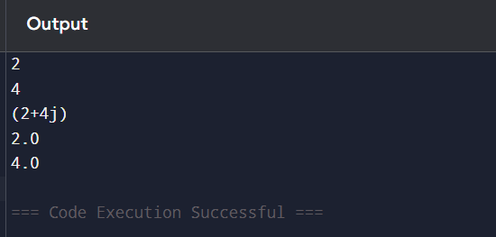

# 🧮 Datatypes-Complex Number Creation in Python

## 🎯 Aim
To write a Python program that reads two integers, creates a complex number using them, and then prints the complex number along with its real and imaginary parts.

## 🧠 Algorithm
1. Read an integer input from the user and assign it to the variable `a` (real part).
2. Read another integer input from the user and assign it to the variable `b` (imaginary part).
3. Create a complex number `x` using the `complex(a, b)` function.
4. Print the complex number `x`.
5. Print the real part of `x` using `x.real`.
6. Print the imaginary part of `x` using `x.imag`.

## 💻 Program
```
a=int(input())
b=int(input())
c=complex(a,b)
print(c)
print(c.real)
print(c.imag)
```
## Output

## Result
The program for complex number is executed successfully.